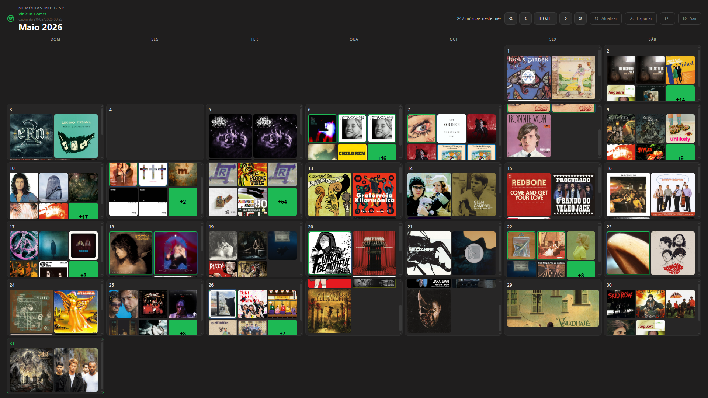
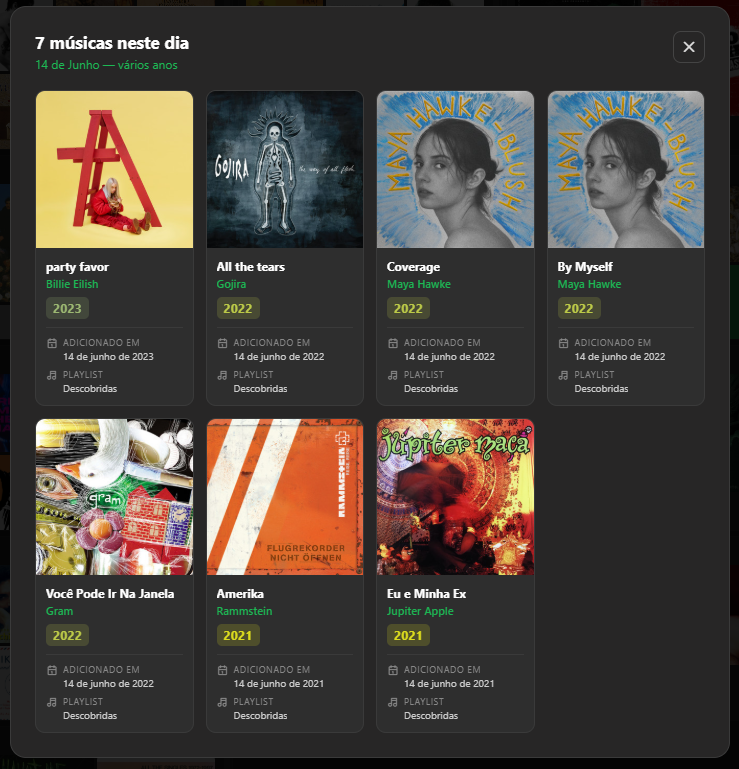
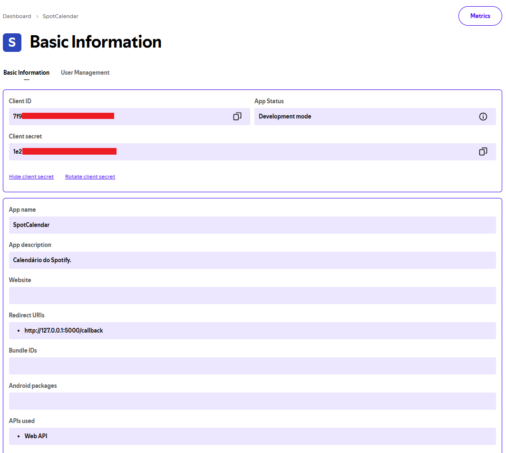

# 🎵 Spotify Memory Calendar

Veja quais músicas você adicionou **hoje em anos anteriores** — um "On This Day" para suas playlists do Spotify.



---

## 📋 Índice

* [Como funciona](#como-funciona)
* [Tela Detalhes](#tela-detalhes)
* [Pré-requisitos](#pré-requisitos)
* [Configurando o app no Spotify](#configurando-o-app-no-spotify)
* [Rodando o executável (.exe)](#rodando-o-executável-exe)
* [Rodando localmente com Python](#rodando-localmente-com-python)
* [Gerando o executável](#gerando-o-executável)
* [Privacidade](#privacidade)

---

## Como funciona

1. Você conecta sua conta do Spotify via OAuth
2. O app lê todas as suas playlists pessoais
3. Filtra as músicas adicionadas **neste dia** em anos anteriores
4. Exibe um calendário com as memórias musicais

Nenhum dado é enviado a servidores externos — tudo fica salvo no `localStorage` do seu navegador.

---

## Tela Detalhes



---

## Pré-requisitos

* Conta no [Spotify](https://spotify.com/)
* App cadastrado no [Spotify for Developers](https://developer.spotify.com/dashboard)

---

## Configurando o app no Spotify

É necessário criar um app no painel de desenvolvedores do Spotify para obter o **Client ID** e o  **Client Secret** .

**1. Acesse o painel de desenvolvedores**

Vá para [developer.spotify.com/dashboard](https://developer.spotify.com/dashboard) e faça login com sua conta Spotify.

**2. Crie um novo app**

Clique em **Create app** e preencha os campos:

| Campo           | Valor                                      |
| --------------- | ------------------------------------------ |
| App name        | Spotify Memory Calendar (ou qualquer nome) |
| App description | Qualquer descrição                       |
| Redirect URIs   | `http://127.0.0.1:5000/callback`         |
| APIs used       | Web API                                    |

> ⚠️ O campo **Redirect URIs** precisa ser exatamente `http://127.0.0.1:5000/callback` — sem barra extra no final.

Ao salvar, o resultado será algo como isso:



**3. Copie as credenciais**

Após criar o app, clique em  **Settings** . Você verá:

* **Client ID** — visível direto na tela
* **Client Secret** — clique em *View client secret* para revelar

Guarde esses dois valores — você vai precisar deles no passo seguinte.

---

## Rodando o executável (.exe)

> Não é necessário ter Python instalado.

**1.** Baixe o arquivo `SpotifyMemoryCalendar.exe` na pasta dist

**2.** Execute o `.exe`

**3.** Na janela que abrir, cole as credenciais copiadas do Spotify:

| Campo         | O que colocar                                |
| ------------- | -------------------------------------------- |
| CLIENT_ID     | O Client ID copiado do painel do Spotify     |
| CLIENT_SECRET | O Client Secret copiado do painel do Spotify |

**4.** Clique em **▶ Iniciar**

O navegador abrirá automaticamente em `http://127.0.0.1:5000` e você verá a tela de login do Spotify.

**5.** Clique em **Entrar com Spotify** e autorize o app

**6.** Aguarde a coleta das playlists — uma barra de progresso mostrará o andamento

**7.** Quando terminar, clique em **Ver calendário** 🎉

Para encerrar, clique em **⏹ Parar servidor** na janela do launcher ou feche-a diretamente.

---

## Rodando localmente com Python

### 1. Clone o repositório

```bash
git clone https://github.com/GomesVinicius/spotify-memory-calendar.git
cd spotify-memory-calendar
```

### 2. Crie e ative um ambiente virtual

```bash
# Windows
python -m venv venv
venv\Scripts\activate

# macOS / Linux
python3 -m venv venv
source venv/bin/activate
```

### 3. Instale as dependências

```bash
pip install -r .\requirements.txt
```

### 4. Configure as variáveis de ambiente

Crie um arquivo `.env` na raiz do projeto:

```env
CLIENT_ID=seu_client_id_aqui
CLIENT_SECRET=seu_client_secret_aqui
REDIRECT_URI=http://127.0.0.1:5000/callback
FLASK_SECRET_KEY=qualquer_string_aleatoria
FLASK_ENV=development
```

### 5. Rode o servidor

```bash
python main.py
```

Acesse [http://127.0.0.1:5000](http://127.0.0.1:5000/) no navegador.

---

## Gerando o executável

> Requer Python 3.10+ instalado e no PATH. O `.exe` é gerado para a plataforma onde o build rodar — execute no Windows para gerar um `.exe` Windows.

```bash
python build.py
```

Isso instala o PyInstaller, todas as dependências e compila tudo automaticamente. O executável aparece em `dist/SpotifyMemoryCalendar.exe`.

---

## Estrutura do projeto

```
SpotifyMemoryCalendar/
├── launcher.py              # Interface gráfica do launcher
├── main.py                  # Entrada do servidor Flask
├── routes.py                # Rotas da aplicação
├── spotify_helpers.py       # Integração com a API do Spotify
├── spotify_calendar.spec    # Configuração do PyInstaller
├── build.py                 # Script de build automatizado
├── .env                     # Variáveis de ambiente (não versionar)
└── templates/
    ├── login.html
    ├── loading.html
    ├── calendar.html
    └── privacy.html
```

---

## Privacidade

* Nenhum dado é armazenado em servidores externos
* O token de acesso do Spotify **não** é salvo após encerrar a sessão
* As credenciais inseridas no launcher ficam apenas na memória enquanto o app roda
* Os dados das playlists ficam exclusivamente no `localStorage` do seu navegador
* Permissões solicitadas ao Spotify: somente leitura (`playlist-read-private`, `playlist-read-collaborative`)

Para revogar o acesso a qualquer momento: [spotify.com/account/apps](https://www.spotify.com/account/apps)

---

## Autor

Feito por [GomesVinicius](https://github.com/GomesVinicius)
